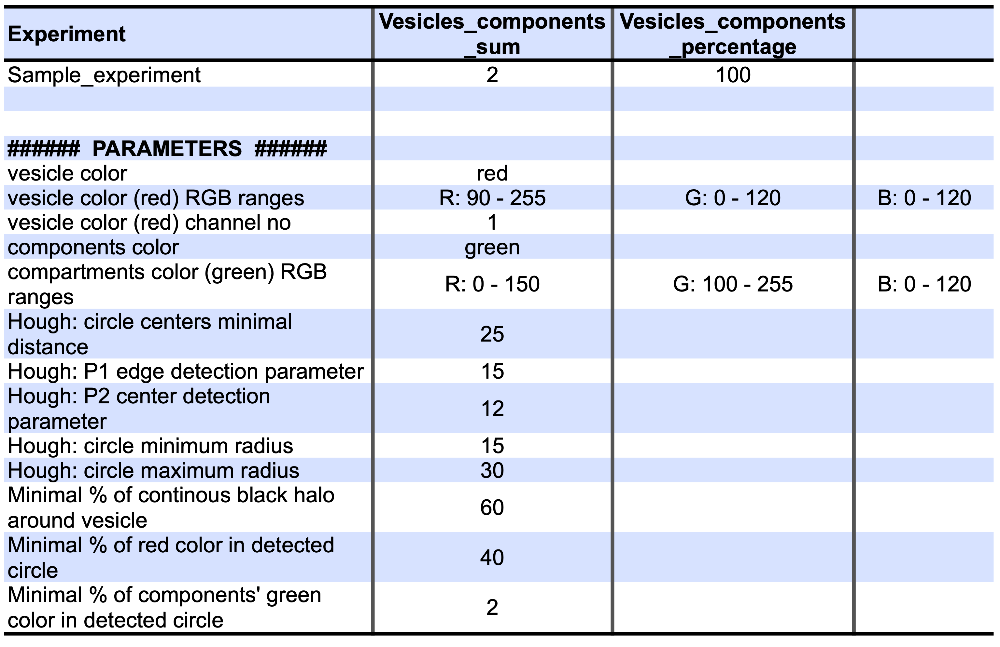
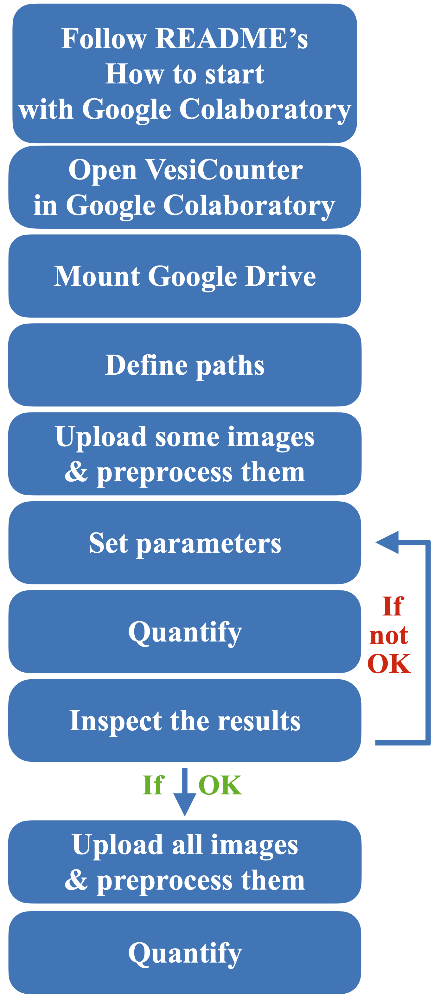
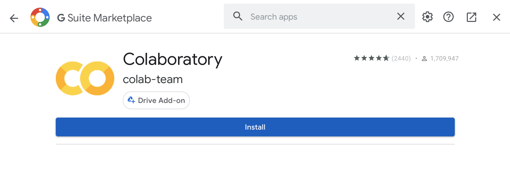

# Welcome to VesiCounter README

<!-- TOC depthFrom:1 depthTo:6 withLinks:1 updateOnSave:1 orderedList:0 -->

- [Overview](#overview)
- [Exophers detection](#exophers-detection)
- [Highlights](#highlights)
- [Input image formats](#input-image-formats)
	- [How to automatically split Z-stacks to separate files using Fiji](#how-to-automatically-split-Z-stacks-to-separate-files-using-Fiji)
- [Algorithm](#algorithm)
- [Output](#output)
- [General pipeline](#general-pipeline)
- [How to start with Google Colaboratory](#how-to-start-with-google-colaboratory)
	- [Connect Google Colaboratory with Google Drive](#connect-google-colaboratory-with-google-drive)
	- [Google Colaboratory in a nutshell](#google-colaboratory-in-a-nutshell)
- [Run VesiCounter](#run-vesicounter)
	- [Run in Google Colaboratory](#run-in-google-colaboratory)
	- [Run locally](#run-locally)
- [Feedback](#feedback)
- [Acknowledgments](#acknowledgments)
- [How to cite](#how-to-cite)
- [License](#license)

<!-- /TOC -->

# Overview

VesiCounter is an easy-to-follow interactive image processing Python 3 pipeline to count fluorescently-tagged round objects. VesiCounter was primarily designed to detect and count exophers (tagged with red mCherry) and exophers containing mitochondria (additionally tagged with green GFP) in *C. elegans* (Turek et al., 2020).

VesiCounter allows for two independent image analysis:

1. Counting round, fluorescently-tagged vesicles
2. Counting round, fluorescently-tagged vesicles with fluorescently-tagged components of different color

VesiCounter runs in the Google Colaboratory cloud environment; therefore, no additional software installations nor any programming skills are required.

# Exophers detection

**Fig. 1A.** Two RFP-tagged exophers secreted from body wall muscles of *C. elegans*. **1B.** Detected two secreted exophers containing GFP-tagged mitochondria.

# Highlights

1. Detects and counts round objects, i.e., vesicles from separate Z-stack photos, paying attention not to count twice the same vesicle from consecutive photos.
2. Allows for easy and extensive parameter customization.
3. Vesicles and their content can be fluorescently labeled in 5 different colors: red, green, orange, pink, and blue.
4. Displayed all found objects in images so the user may easily change  detection parameters to set the thresholds according to needs.

# Input image formats

VesiCounter accepts single images or multiple Z-stacks from different experiments (from single or both channels). VesiCounter operates with split in Fiji Z-stack images with their default names.

Split Z-stack pair images must comply with the following naming convention:

**EXPERIMENT NAME.czi - ... C[=0][1/2] ... .format**

e.g.

`Experiment-57 pas-1 1.02.czi - Z=1 C=1.png`

or

`Experiment-57 pas-1 1.02.czi_z001_c001.tif`

Corresponding images from the same plane from both channels should have different C (1 or 2) in their name so the program can distinguish them.

Each split Z-stack should be placed in a separate directory. Group of single images can be placed in common directory. All the data directories should be uploaded to the `VesiCounter/inputs/` as described in Jupyter Notebook.

**Possible image formats are png and tif.**

## How to automatically split Z-stacks to separate files using Fiji

1. Download macro [export_images_folder.ijm](https://gist.github.com/lacan/16e12482b52f539795e49cb2122060cc) (click download zip in the right upper corner)
2. Open Fiji
3. Plugins -> Macros -> Install -> [Choose path to downloaded ijm file]
4. Prepare a directory with all Z-stacks (czi files)
5. Plugins -> Macros -> export_images_folder -> [Choose path to directory with all Z-stacks]

Now all the Z-stacks should be splitted to separate images (considering their different focal planes and channels)!

# Algorithm

Makes circle Hough transform on images to detect round objects, filtering out circles not possessing defined percentage of selected color and continuous black halo. Remaining circles are considered as searched vesicles. For example, we search for red exophers. First, we detect all round objects on an image (also noisy ones) according to customized circle Hough transforms parameters. Next, circles that are not e.g., at least 40% red and are not e.g., at least 60% on a black background, were filtered out.

If we additionally want to detect vesicles containing a cellular component of interest marked with a different color, we check 3 corresponding images (focal planes -1, 0, +1) from the second channel to see if our correctly detected vesicles are e.g., at least 2% green.

# Output

Quantification results as well as selected parameters will be saved in `VesiCounter/outputs_summmary/` as csv files with the timestamp and name appropriate to analysis type.

**Fig. 2.** Sample quantification result along with selected analysis parameters.

Runing VesiCounter with `Save: Yes` parameter, as described in detail in Jupyter Notebook, will save all images copies to appropriate directory; detected vesicles will be marked as yellow circles, so user may visually inspect the results and optimize detection parameters.

# General pipeline

**Fig. 3.** Simplified pipeline; all the instructions regarding quantification analysis and customing parameters can be found in the Jupyter Notebook.

# How to start with Google Colaboratory

## Connect Google Colaboratory with Google Drive

   1. Sign in to your Google account

   2. Proceed to My Drive -> More -> Connect more apps

   

   
   

   3.   Type `colab` in the search bar

   

   
   

   4. Install Google Colaboratory

   

   
   

   If you want to read more about Google Colaboratory, we recommend to follow this [link](https://towardsdatascience.com/getting-started-with-google-colab-f2fff97f594c)

## Google Colaboratory in a nutshell

* **Running a cell**

In Jupyter Notebooks code is divided into cells, to run the chunk of code within a cell, simply click on the Play icon in the upper left corner of the cell.

---

* **Common troubleshooting:** cell running for too long

If a cell runs too long, it may mean that Google Colaboratory has encountered a problem.

You may either interrupt cell execution...

...or restart runtime **(but you will have to click all Jupyter Notebooks cells once again)**

---
**NOTE**

*Counting vesicles or vesicles containing particular cellular components may take time, especially for large image datasets.*

---

# Run VesiCounter

We recommend to use VesiCounter in Google Colaboratory environment, but users with programming experience may also run it locally on their computer.

## Run in Google Colaboratory

1. In your Google Drive, create new directory called `VesiCounter` (**do not misspell**)

2. Download this repository

3. Open the newly downloaded directory VesiCounter-master and save Jupyter Notebook `VesiCounter.ipynb` to `VesiCounter` directory of your Google Drive (the easiest way is to drag and drop).

   You may also copy the directory `inputs` from this directory into `VesiCounter` directory to run it for the first time with our sample exophers images.

   If you want to learn more about Jupyter Notebooks, we recommend to watch this [video](https://www.youtube.com/watch?v=q_BzsPxwLOE)

4. Double click on `VesiCounter.ipynb` on your Google Drive, then at the top click `Open in Google Colaboratory`

5. Follow the instructions in the Jupyter Notebook.

## Run locally

Users should install [Python 3.6](https://www.python.org/downloads/) and [Jupyter Software](https://jupyter.org/install)

Required dependencies are:

- cv2
- numpy  
- matplotlib
- ipywidgets

# Feedback

We welcome any feedback, please send an email to Natalia Szulc, @n-szulc 

# Acknowledgments

Special thanks to Dr. Małgorzata Piechota for all the suggestions on vesicles recognition algorithm design and Konrad Kowalski for sample Z-stack preparation.

# How to cite

Authors:

Natalia A. Szulc, @n-szulc 

Wojciech Pokrzywa, @WPokr 

 

If you use VesiCounter, please cite:

**VesiCounter - an easy-to-use tool to automatically quantify fluorescently labeled vesicles**

Natalia A. Szulc, Wojciech Pokrzywa [in preparation]

# License

VesiCounter is licensed under the GNU General Public License v3.0
